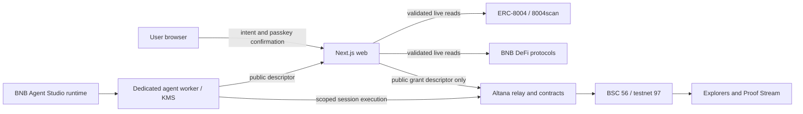

# ProofEra architecture

Updated: 2026-08-12. This document describes the target architecture and the local boundaries already built to support the judged journey without turning registry metadata or simulated results into execution authority. The complete diagram is not a deployment-status claim.

## System boundary

In the target deployment, the browser owns the user's passkey ceremony and displays exactly what will be granted. The marketplace server owns data ingestion, recommendation rules, and policy preparation, but never an admin key or autonomous session private key. A dedicated worker/KMS would own only a scoped session signer. No concrete worker/KMS, passkey grant, or live authority is configured today. BSC and partner explorers remain the source of truth for onchain state.

## Repository boundaries

| Boundary                        | Responsibility                                                                          | May not do                                                                               |
| ------------------------------- | --------------------------------------------------------------------------------------- | ---------------------------------------------------------------------------------------- |
| `apps/web`                      | Goal-first UX, server rendering, live-data state, passkey ceremony, status presentation | Invent evidence, expose server keys, claim a pending revoke is complete                  |
| `packages/domain`               | Strict evidence/passport schemas, Proof Score, suitability and activation policy        | Fetch networks, read environment secrets, know UI framework state                        |
| `packages/integrations`         | Runtime-validated 8004scan, Altana, BSC and protocol adapters                           | Replace failures with fixtures, trust metadata as an execution allowlist                 |
| `packages/benchmarks`           | Pure paired-run validation, canonical hashes, exact cost/time deltas and receipt joins  | Execute commands, fetch evidence, invent results, convert currencies or declare a winner |
| `agents`                        | Exact-pinned BNB Agent Studio reference agents and health endpoints                     | Store unencrypted wallets or rely on a 48-hour trial during judging                      |
| `contracts/testnet-fixed-asset` | Isolated fixed-supply chain-97 fixture plus unsigned deployment/pool preparation        | Act as a protocol guard, stablecoin, valued asset, deployment/pool proof, or authority   |
| `evidence`                      | Non-secret manifests, raw outputs, hashes, receipts and limitations                     | Contain keys, fabricated hashes, or unlabelled simulations                               |

Reference-agent analysis and execution are separate capabilities. LP, Grid, Yield, and Health-Factor packages expose strict local A2A/MCP analyzers over caller-supplied, source-identified evidence. They schema-enforce non-execution and leave unverified realized outcomes unknown. All four now have hardened exact-pinned Studio/HTTP packaging and local suites of 17, 24, 33, and 37 tests respectively, plus fail-independent CI matrix entries. The marketplace renders one validated development dossier for each category while fixing every live, registration, marketplace, activation, and execution flag to false. Each metric independently says either `implemented_not_run` with the exact analyzer version or `definition_documented_calculator_absent` with no version; the implemented set is LP `current_range_state`, Grid `configured_range`, Yield `net_apy`/`gas_impact`, and Health `current_health_factor`/`minimum_health_factor`/`alert_latency`. The dossier never applies one analyzer-wide method label to fields the code does not calculate. None is publicly hosted or ERC-8004-registered. A future hosted execution worker must add authenticated evidence ingestion, policy/authority checks, durable idempotency, health probes, and a receipt pipeline. Analyzer availability alone never makes an agent hireable.

## Marketplace read path

1. A bounded intent parser accepts category, capital, risk, horizon and asset preferences. Unknown query values fall back to safe defaults and never become arbitrary upstream requests.
2. A server-only 8004scan adapter validates the response and returns an `available` or `unavailable` union. A successful empty list is distinct from an outage.
3. Registry records are labelled as identity observations. Self-declared names, descriptions and protocols are untrusted text; they do not establish capability, performance, endpoint safety or permission scope.
4. A curated Agent Passport joins registry identity with independent, source-linked evidence. Bare metric values are invalid.
5. The versioned recommendation engine applies one requested category, chain, capital, complete requested-asset coverage, permitted-protocol overlap, risk tolerance and permission horizon. Stale/missing evidence remains insufficient rather than imputed, duplicate candidates cannot occupy multiple recommendation slots, and no APY, PnL or other economic return is used for ordering.
6. Proof Score operates only on validated, category-bound evidence. Cross-category returns are not ranked as if they were equivalent.

The marketplace page isolates registry suspense from its local intent/analyzer shell: intent controls and the four non-live development records render before 8004scan settles, and only the registry region transitions through pending/available/authoritative-empty/unavailable states. The category mandate routes are another deliberately narrower boundary. `/lp-activate` remains the LP-specific bounded configuration surface; `/configure/grid-trading`, `/configure/yield-optimisation`, and `/configure/health-factor-monitoring` parse allowlisted GET fields into exact raw values and an explicit chain 56/97 choice. Those three configuration handlers perform no RPC read, HTTP fetch, application-environment lookup, wallet access, or write, and every evidence/identity/permission/authority/receipt/activation/execution/revoke readiness flag remains false.

Marketplace evidence is still limited to bounded Next.js caching. The one deliberate persistence exception is the activation replay ledger: a server-only PostgreSQL 17 append-only schema atomically consumes context and quote IDs. Its versioned migration pins an OID-free catalog/ACL/rule digest, an administrator verifier issues an in-process nominal capability, and a separate least-privilege application pool exposes `consumeOrRead` only after that proof plus a fresh access probe. The activation package recognizes that exact WeakSet-backed capability rather than any structurally similar callback; the internal mint is not a package export. Evidence time series and a broader worker index still require measured retention/load need.

Protocol position reads preserve one-block consistency without requiring an archive RPC. A first latest Multicall3 batch discovers only the token/fee routing tuple and is never evidence. A second unsplit latest batch reads Multicall3 block context plus all position, pool and factory values. ProofEra publishes only that second batch after an exact-block header agrees on number, timestamp and parent hash. The current block hash cannot be exposed from inside its own EVM execution, so the displayed hash is explicitly labelled as the immediate post-snapshot header value rather than an in-batch value. Discovery drift, detected reorg signals, malformed data and provider failure all return `unavailable`; successful calls establish callable presence, not a reviewed code hash.

Write readiness uses two separate EIP-1898 boundaries. The code reader accepts an already bound number/hash/timestamp and reads code only with `{blockHash, requireCanonical:true}`. The position-authority reader verifies that same block, then reads `ownerOf`, `getApproved`, and `isApprovedForAll` only at the canonical hash. It classifies owner, token-controller, operator-controller, or unauthorized without treating a revert as lack of authority. Neither reader falls back to `latest` or a block-number selector. Code hashes do not prove verified source or proxy safety, and authorization must be revalidated immediately before submission because approvals can change after the observed block.

## Evidence model

Every metric is a discriminated envelope:

- available: value, unit, source, source observation time, ingestion time, method, freshness and environment;
- unknown: no reliable observation exists, with a reason;
- unavailable: an expected source was attempted but failed, preserving attempt/provider context and optional last-good evidence;
- environment: fixture, simulation, BSC testnet or mainnet.

Fixture and simulation evidence may exercise code but cannot populate a strict live publication path or a realized-performance field.

## Activation and execution path

Activation is a three-party protocol:

1. A server boundary strictly re-resolves raw user intent and fresh server evidence, then derives and revalidates one immutable chain-97 policy. Context schema v3 embeds the complete strict intent and block-pinned quote. Domain-separated IDs hash that complete payload with server-held nonces. Its direct-call manifest, token caps, minimums, recipient, position, ticks, quote window, deadlines and expiry come only from the resolved inputs; this step creates no preview, key, authority, calldata, signature or transaction.
2. The reviewed-deployment input carries a `reviewId` derived from the canonical complete manifest: source URL/review time, fee/tick spacing, token addresses/decimals/code hashes, and Position Manager/factory/pool/deployer/wrapped-native identities. Write-target attestation v2 then binds exact source/compiler/runtime evidence plus four separately reviewed direct selector paths. It discloses the manager's observed self-`DELEGATECALL` in `multicall(bytes[])` and denies that selector plus both other multicall overloads. The corrected local artifacts and dispatcher boundary are raw-byte content-addressed, reproducible, and bound to the same lowercase-manager write-scope hash as the integration seam, but content addressing proves snapshot integrity rather than reviewer authenticity. A server-only intake requires canonical bytes at digest-named public HTTPS URLs, fresh independent no-redirect retrieval records, exact reviewer/retriever identities, and a separately provisioned batch review ID before emitting the nested selector assessment. It rejects the local artifacts and still cannot emit a full attestation or authorize execution.
3. The Altana handoff descriptor-snapshots raw inputs, reruns the policy builder, and maps the exact calls, spends, wallet, hash and expiry into a short-lived public bootstrap request only after a nominal server-only `consumeOrRead` capability returns an exact atomic receipt. Policy and write-target evidence join on block number, hash, and timestamp. Monotonic clocks recheck receipt expiry and target freshness after durable access; any final veto is `committed_unusable` and discards the nested bootstrap. It rejects a bootstrap window that reaches context/quote/transaction/session expiry and does not accept a serialized ready-policy object.
4. The future worker/KMS creates and retains a session private key. It gives the marketplace only a public descriptor bound to that bootstrap record, user, wallet, policy hash and nonce.
5. The browser grant boundary accepts only the exact persisted `grant_ready -> grant_submitting` transition, a production WebAuthn P-256 signer whose explicit RP ID matches the configured domain, and an atomic one-shot submission claim. A separate append-only PostgreSQL 17 ledger claims four immutable identifiers atomically and returns only an exact prior binding on replay. Its canonical migration, independent catalog/ACL verifier, module-owned same-pool READ COMMITTED gateway, bounded SQL, no-retry/ambiguous-commit semantics, and real PostgreSQL suite pass. Only the safe server composition is package-exported; no deployed database or browser ceremony exists. The browser boundary then calls exact SDK 0.7.0 with exact target/function pairs, token spend caps and expiry. The browser never receives the private session key.
6. The worker independently reads the account/Keystore authority and compares wallet, public key, byte-exact permissions, expiry and canonical policy hash before enabling execution.

The pure context assembler derives domain-separated context and quote IDs but deliberately reports `idConsumptionAtomic: false`. Both CSPRNG nonces stay server-side; the downstream resolver recomputes the IDs over context schema v3's complete context, quote, exact intent and write-target binding before trusting either value. The server handoff requires an exact receipt from the nominal `consumeOrRead` capability before returning ready. The concrete PostgreSQL path uses READ COMMITTED without application retry, immutable unique context/quote IDs, explicit ambiguous-commit outcomes, a canonical PostgreSQL 17 migration/verifier, and a direct-login application role limited to schema usage plus table SELECT/INSERT. It passed 10 real PostgreSQL 17.9 integration cases, but no production database is configured and this does not create worker authority or activation readiness.

Altana SDK 0.7.0 discards the grant `callsId` when its internal wait yields pending/failed. A thrown pending/transport result is `outcome_unknown`: action and retry remain disabled until the authority probe resolves it. Even a resolved SDK session advances only to `authority_pending`; it is never execution evidence by itself.

### Enforcement layers

| Control             | Enforcement owner                                                                | Examples                                                                                                           |
| ------------------- | -------------------------------------------------------------------------------- | ------------------------------------------------------------------------------------------------------------------ |
| Altana / onchain    | Account validator and token accounting                                           | target+selector pair, raw token spend per period, expiry, revocation                                               |
| ProofEra runtime    | Reviewed manifest and semantic calldata validation immediately before submission | chain/code identity, token ID, recipient, tokens, ticks, minimum amounts, quote age, deadline, execution frequency |
| Wallet confirmation | User passkey                                                                     | reviewed grant and admin revoke intent                                                                             |

Outer selectors do not constrain function arguments. Milestone 1 therefore prefers direct PancakeSwap V3 Position Manager calls and denies generic routers, multicall, Permit2 and arbitrary transfer/approval helpers. If recipient/token ID/slippage guarantees must survive a compromised worker, a small audited onchain guard becomes justified; the UI must not describe runtime-only rules as onchain-enforced.

The permission-preview view-model is derived from the canonical policy and begins with worst-case authority. It preserves contract/signature/selector pairing and raw-unit caps, renders untrusted labels as text data, and assigns every row to exactly one of the three enforcement owners above. Building a preview does not replace server-owned policy validation or unlock confirmation.

## Transaction state

Grant, execute and revoke are explicit state machines. `requested`, `pending` and `outcome_unknown` never appear as confirmed. Execute/revoke retain their Altana `callsId` for reconciliation. A revoke remains active/pending until account authority is observed invalid; a UI click is not revocation evidence.

The Proof Stream stores operation type, canonical policy hash, public wallet/session identifiers, environment, source/call IDs, transaction hash when present, timestamps and status transitions. It never stores signers.

## Deployment shape

- Marketplace: one durable Next.js deployment on a stable HTTPS origin.
- Passkey: a stable, explicit RP ID compatible with that origin; never inferred from forwarded host headers. Production rejects IP, special-use, and public-suffix-only hosts through an exact-pinned Public Suffix List parser.
- Operations: `/api/health` proves only process liveness. `/api/readiness` reports configuration and capability states without secrets, describes provider-backed adapters as unprobed until actually checked, and cannot report activation ready before the worker handoff exists.
- Agent runtime: durable self-hosted or AWS AgentCore path prepared by `bag deploy prepare`; the BNB-managed 48-hour test deployment is evidence-window tooling only.
- Network: BSC testnet first for control proof. Mainnet registration/execution requires explicit approval and minimal-value runbook.
- Contracts: no custom execution or calldata-guard contract until a specific guarantee gap justifies and can be audited. The isolated PTA fallback is only a non-economic testnet asset and creates no write authority or pool eligibility by itself.

## Architecture gates

- No agent becomes hireable until endpoint, live status, category evidence and revoke path are independently checked.
- No autonomous action until public-key handoff and authority verification pass on exact Altana 0.7.0.
- No Pancake write until source/runtime identity, selector-scoped path review, eligible token/pool behavior, current authority and semantic calldata validation all pass immediately before signing. The reviewed CAKE/WBNB testnet candidate is explicitly blocked.
- A bounded exact-lineage search rejected all 14 reviewed WBNB pools. Exact WBNB source/runtime/control provenance is reproducible, and PTA is separately deployed with a finalized exact-runtime/fixed-supply receipt. These close only the two token-component identities for a prospective pair. The search is not an exhaustive factory-lifetime proof, and neither token result waives a fresh exact-block code binding, pool factory lineage, oracle, liquidity, mutable-control, position-ownership, and authority review for a new fixture.
- No public deployment until stable origin/RP ID, durable agent uptime, secret storage, headers, monitoring, license obligations and rollback are verified.
